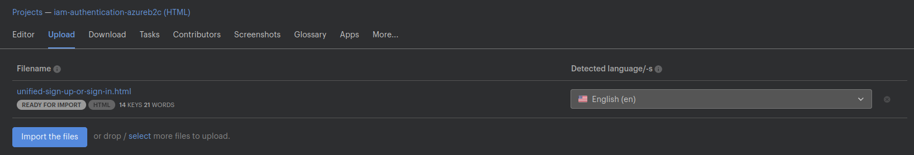
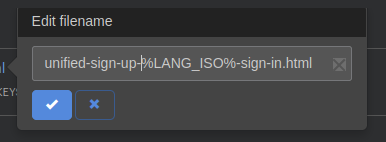
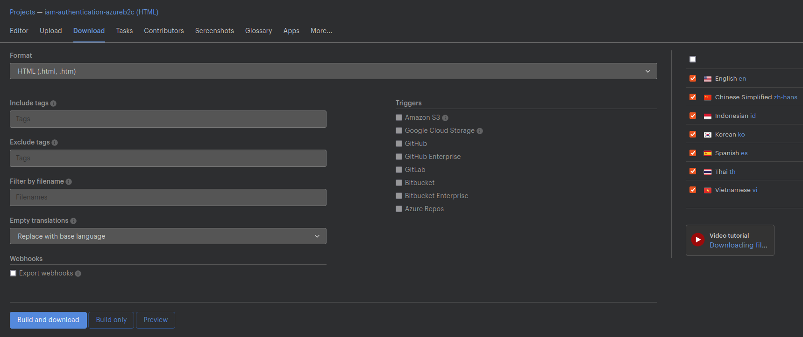

# README

## FAQ

### What is this repository for?

This repository contains the UI for our user policies in Azure B2C.

### How do I get set up?

-   Install _Azure AD B2C_ VSCode extension
-   Follow [instructions](https://github.com/azure-ad-b2c/vscode-extension/blob/master/src/help/policy-upload.md#configure-your-vs-code-extension) to setup the extension to enable Custom Policy uploads, using the `vscode-extension` application ID

### Contribution guidelines

See [guidelines](#guidelines).

Contribute to [Custom policies](#contribute-to-custom-policies)

### Who do I talk to?

The IAM team

## Structure

### assets

All images referenced in the HTML templates from the [#pages] folder

### css

#### global.css

`button` or `input` styling i.e. any generic components

#### fairground.css/kids.css

Design/layout specific CSS.

Currently we have a `fairground` and `kids` layout, which are used on `unified-sign-up-or-sign-in`/`local-account-sign-up` and `forgot-password`/`change-password` respectively.

NB: Any page-specific styling should go in the corresponding `page` folder and named `index.css`.

### external

The `local-account-sign-up` page contains a link to the KidsLoop privacy policy.

The future intention is to use [OneTrust](https://www.onetrust.com/), but until this is setup we link to a copy of the <PrivacyPolicy/> React component in plain CSS/HTML from [kidsloop-branding](https://github.com/KL-Engineering/kidsloop-branding).

### fonts

B2C limits the number of CORS whitelists per tenant.

To avoid using up all whitelists, we self-host our fonts in the same Azure blob storage as our other UI assets.

### js

Global/common JS e.g. password visibility toggles, utilities

### locale

`json` translations output from Lokalise, which are converted to B2C format and inserted into [TRUST_FRAMEWORK_LOCALIZATION.xml](./src/policies/TRUST_FRAMEWORK_LOCALIZATION.xml) by the [updateLocalizationXmlWithNewTranslations](./scripts/updateLocalizationXmlWithNewTranslations.ts) script.

### pages

HTML, CSS and JS specific to a page in a B2C user journey.
Each page corresponds to a `ContentDefinition` in [TRUST_FRAMEWORK_LOCALIZATION.xml](./src/policies/TRUST_FRAMEWORK_LOCALIZATION.xml).

#### Localization

Every KidsLoop supported language has a separate HTML template.
These contain different `alt` attributes on images, `<title>` tags, and localized text.
B2C dynamically selects the HTML template based on the `ui_locales` query param, which is set when [iam-auth-frontend](https://github.com/KL-Engineering/iam-auth-frontend) initiates the login journey.

NB: The B2C language code for Chinese is "zh-Hans", which doesn't match the Kidsloop "zh_CN" (The capital 'H' is important). All other language codes are the same in both systems.

#### HTML

HTML templates should use relative links to assets e.g. `./index.css` or `../assets/logo.svg`.

NB: any links to JS should be full path links to Azure storage. See (TODO section)[#js-script-injection-into-html-templates] on why this is necessary.

#### Tips

Be careful inserting/modifying HTML content inside the `<div id="api">`, as B2C performs most validation with jQuery client-side, and that validation logic depends on the HTML structure.
For example, a previous approach with password visibility toggles involved creating a "wrapper" div with `display: flex` around a password input, and inserting the toggle into that wrapper.
This broke the password input validation on the "local-account-sign-up" page.

Any script relying on elements inserted by B2C into `<div id="api">` should be added to the bottom of `<body>`.
This is to avoid firing before B2C has had time to insert the content (i.e. `<script>` tags in `<head>` with setup in `document.readyState === "complete"` will fire too early).

### policies

B2C custom policies.

General information can be found [here](https://docs.microsoft.com/en-us/azure/active-directory-b2c/custom-policy-overview).

The B2C policy files, and the flows themselves, follow a hierarchy.

The last layer is the [RELYING_PARTY_SIGN_UP_LOG_IN.xml](./src/policies/RELYING_PARTY_SIGN_UP_LOG_IN.xml), and the policy inheritance can be followed by looking at the `<BasePolicy>` element.
Any change in a parent layer can be overridden in a child e.g. a setting in `BASE` will be overridden by the same setting in `EXTENSIONS`.

The top level of the `RELYING_PARTY_SIGN_UP_LOG_IN` flow is the `UserJourney` element in [TRUST_FRAMEWORK_EXTENSIONS.xml](./src/policies/TRUST_FRAMEWORK_EXTENSIONS.xml).

#### Points of interest

##### User Journeys

The default `UserJourney` can be set in [appsettings.json](./src/policies/appsettings.json).

Main UserJourneys:

-   SUSI-PhoneOrEmail = KidsLoop local accounts + KidsLoop corporate tenant + MCB SSO
-   SUSI-PhoneOrEmail-FederatedOnlyEntryPoint = MCB SSO only
-   SUSI-PhoneOrEmail-LocalAndKidsLoopOnlyEntryPoint = KidsLoop local accounts + KidsLoop corporate tenant

While the `OrchestrationStep`s are slightly different for each journey, the final steps are always `SUSI-PhoneOrEmail-Handler` (bulk of the flow logic can be found here) and `SendClaims` (create JWT).

##### MCB SSO

To enable MCB SSO, you will need:

-   `Sign_Up_Log_In:DefaultUserJourney` set to "SUSI-PhoneOrEmail" or "SUSI-PhoneOrEmail-FederatedOnlyEntryPoint"
-   `EnableFederatedIdps` set to "{OAUTH-KV:idps}" (enable IDPs passed in `?idp` query param) or "MCB" (i.e. hardcode IDP)
-   `MCBClientId`
-   `MCBMetadataUrl`
-   `MCBValidTokenIssuerPrefixes`

The last 3 settings vary per MCB environment (e.g. their test/staging/production)

When MCB SSO is enabled, the "claims-provider-list-buttons" div on the "unifiedssp" `ContentDefinition` includes a `SiginWithMCBCredentials` button.
By passing the `?domain_hint` query param of "MCB", we "skip" the login page and should be directly logged in with MCB SSO.

##### Phone user flows

B2C samples exist for phone logins, but they all use One-Time Passwords (OTPs).
The business wanted passwords for both phone and email, and to have phone and email in the same journey (i.e. you can toggle between the two) so our implementation is custom.

The login page defaults to email, but includes a "Use phone number" link which corresponds to the "SigninWithPhone" `ClaimsExchange`.

This shows a phone login page, which is similar to the email login page, but is missing:

-   "Forgot password" link
-   Create account links
-   Password input

This is B2C limits a login page (in B2C terms, a `unifiedssp` `ContentDefinition` - see [here](https://docs.microsoft.com/en-us/azure/active-directory-b2c/contentdefinitions#datauri)) to maximum 2 inputs.
For email login, this is the email input + password input.

For phone login, the phone input is actually two inputs (one for "countryCode", one for "nationalNumber"), which means we can't use the `unifiedssp` `ContentDefinition` and have country code dropdown + national number input + password input.

The solution was an interim page using the "selfasserted" `ContentDefinition`, with a "countryCode" and "nationalNumber" input, which on completion will show a phone `unifiedssp` page (with a single "phoneNumber" text input populated from the previous page and a password input).
These are the "SelfAsserted-LocalAccountSignin-PhoneNumber" and "SelfAsserted-LocalAccountSignin-PhoneNumber-Actual" `TechnicalProfile`s respectively.

On this 2nd phone login page, the "Forgot password" link corresponds to the "ForgotPasswordPhone" `TechnicalProfile`.
The "Use email" link is inserted with JS and uses `history.back()`, as including a `ClaimsExchange` for email login at that `OrchestrationStep` isn't possible (it introduces a circular dependency in the `UserJourney`, which B2C doesn't allow).

##### Locale

Locale is set by the `ui_locales` query param when initiating the B2C `UserJourney` (which is set based on the KidsLoop `locale` cookie by [iam-auth-frontend](https://github.com/KL-Engineering/iam-auth-frontend)).

In order to change the language, the page is hard reloaded with a different `ui_locales` query param.

NB: Once a `UserJourney` is started (i.e. the user moves to a different page), the locale is _locked in_.

Therefore the language selector is only shown on the B2C entrypoint (email login), as the language can't be changed anywhere else.

##### General configuration

High level configuration is detailed [here](https://calmisland.atlassian.net/wiki/spaces/IAM/pages/2452455931/B2C+low-level+design).

In summary:

-   each region (e.g. Asia) has a shared Azure storage account
-   each KidsLoop deployment (e.g. Pakistan production) has a separate B2C Tenant and separate Azure storage container
-   KidsLoop AD settings are hardcoded

##### DefaultISO3166CountryCode

For the "countryCode" dropdown, the `ClaimType` in [TRUST_FRAMEWORK_EXTENSIONS.xml](./src/policies/TRUST_FRAMEWORK_EXTENSIONS.xml) contains an [enumeration](https://docs.microsoft.com/en-us/azure/active-directory-b2c/claimsschema#enumeration) of possible country codes.

To set a default, specify the `Value` attribute of the desired `Enumeration` element (e.g. "SE" for Sweden).

##### Email normalization

To simplify downstream use, emails are trimmed and lowercased before inserting into the JWT.

While this is done for local accounts on signup, it's also required for SSO (with both MCB and KidsLoop AD) as we can't trust that this normalization has already been done.

##### Unique ClaimsExchange Ids

Looking at `SUSI-PhoneOrEmail-Handler` `SubJourney`, you'll notice `ClaimsExchange` with Ids of "LocalAccountSignUp2", "SignupWithEmail2" etc.
This is because earlier on (in the parent `UserJourney`), we have Ids of `LocalAccountSignUp`, `SignupWithEmail` etc.
If the same Id is used twice in the same overall journey, the user journey won't work.

NB: The `TechnicalProfileReferenceId` is the same, it's just the `Ids` that need to be unique.

#### Tips

Samples can be found [here](https://github.com/azure-ad-b2c/samples), which are useful to copy from/use as a reference.

[TRUST_FRAMEWORK_BASE.xml](./src/policies/TRUST_FRAMEWORK_BASE.xml) should not be changed.
Instead, add/change [TRUST_FRAMEWORK_EXTENSIONS.xml](./src/policies/TRUST_FRAMEWORK_EXTENSIONS.xml) to override blocks in the BASE.

Use the [correlation-id](https://docs.microsoft.com/en-us/azure/active-directory-b2c/troubleshoot?pivots=b2c-custom-policy) of a failed request to follow the logs in `AppInsights` when debugging an error in the flow.

### types

Reusible TypeScript types

## Guidelines

### Translations

#### B2C

The Lokalise project is called [iam-authentication-azureb2c](https://app.lokalise.com/project/3182637961d6c45679cc44.06370405/)

Any new `<LocalizedString>` or `<LocalizedCollection>` should ideally be created in Lokalise, then downloaded, then run our [updateLocalizationXmlWithNewTranslations](./scripts/updateLocalizationXmlWithNewTranslations.ts) script to convert the JSON file into the B2C XML format.

Note, Lokalise converts nested JSON into a flat key, where each level is separated by `::`.

The JSON structure mimics the `TRUST_FRAMEWORK_LOCALIZATION.xml` hierarchy, which enables us to convert our JSON back into the XML format.

If you want to add new strings to the XML directly, you can add the new entries, then use the [LocalizationXMLtoJSON](./scripts/LocalizationXMLtoJSON.ts) script to convert from XML to JSON, but remember to upload to Lokalise afterwards or your new strings won't get translated!

#### HTML

The Lokalise project is called [iam-authentication-azureb2c (HTML)](https://app.lokalise.com/project/7931918561df16e85482d1.17678014/)

Any changes to the HTML pages should be done on the `en` version of the template.

e.g. for `unified-sign-up-or-sign-in`, modify `unified-sign-up-or-sign-in/en/index.html`

Once your changes are complete, perform the following steps:

##### Repo -> Lokalise

Copy the HTML file to another location, and rename to the name of the page

e.g. rename `index.html` from `pages/forgot-password/en` to `forgot-password.html`

Open the "iam-authentication-azureb2c (HTML)" project, and press the Upload tab



NB: on unified-sign-up-or-sign-in, the auto-detected language is not English, so you'll need to manually select that. Additionally, click the filename and remove the _%LANG_ISO%_ placeholder Lokalise tries to insert



This will:

1. Add any new strings to Lokalise to be translated
2. Update the HTML on Lokalise for each page

NB: Even if you have made **no changes** to text content of the page, you will still need to do this (OR make the same changes to every language manually)

##### Lokalise -> Repo

First, download the HTML templates from Lokalise with the options below.



Download creates a ZIP file with the following folder structure:

```text
root
├── en
│   ├── change-password.html
│   ├── forgot-password.html
│   ├── local-account-sign-up.html
│   └── unified-sign-up-or-sign-in.html
├── es
│   ├── change-password.html
│   ├── forgot-password.html
│   ├── local-account-sign-up.html
│   └── unified-sign-up-or-sign-in.html
├── ...[other languages]
```

This needs to be converted to the following directory structure:

```text
pages
├── change-password
│   ├── en
│   │   └── index.html
│   ├── es
│   │   └── index.html
│   ├── ...[other languages]
│   ├── index.css
├── forgot-password
│   ├── en
│   ...
├── ...[other pages]
```

First, unzip the folder.

Then, use the [MoveTranslatedHTML](./scripts/MoveTranslatedHTML.ts) script to correct the format, with the folder path (relative or absolute) of the unzipped Lokalise download as the first argument.
e.g. if folder found at "~/Downloads/lokalise", run

```sh
npx ts-node scripts/MoveTranslatedHTML.ts ~/Downloads/lokalise
```

## Build

HTML/JS/CSS/Assets are built with Webpack to the `dist` directory.

The contents of `dist` are uploaded to an Azure blob storage container (either manually for local development, or by the CI pipeline).

### Details

#### Policies

Placeholders like `{settings:AZURE_STORAGE_ACCOUNT}` are substituted in the policy XML files using the `PolicySettings` JSON object in [appsettings.json](./src/policies/appsettings.json) per `Environment.

#### HTML

`extract-loader` allows using a HTML file as an entrypoint.

`html-loader` creates an index.js file from each index.html file, and prefixes all relative links with the `publicPath` in the Webpack config (which is set to the root of our Azure storage account).
Additionally, it removes comments and minifies the HTML.

`extract-loader` then converts that JS file back into a HTML file.

As `extract-loader` is a slightly older package, it doesn't work with (Asset Modules)[https://webpack.js.org/guides/asset-modules/], so for CSS/images we need to use the older `file-loader` instead.

## Contribute to custom policies

-   To ensure you dont override policies which are deployed on SSO or other environments, work on your localy copy, once happy then commit and merge
-   Download Azure AD B2c plugin for VsCode
-   Open [appsettings.json](./src/policies/appsettings.json)
-   Under `Environments` add below snippet and replace `<Initials>` with yours

```
{
    "Name": "SSO-<Initials>",
    "Production": false,
    "Tenant": "kidsloopb2c.onmicrosoft.com",
    "PolicySettings" : {
        "PolicyNamePrefix": "<Initials>_"
    }
}
```

-   Launch VSCode in a new window and open folder `src/policies`
-   `cmd + shift + P` and enter `B2C Policy Build` to build the policy
-   Upload your changed policy:
    -   Automated approach
        -   `cmd + shift + P` and enter `B2C Upload all policies`, or `B2C Upload current policy` after opening the relevant (built) policy file e.g. `src/policies/Environments/SSO-INITIALS/TRUST_FRAMEWORK_LOCALIZATION.xml`
        -   Press the "Login" button on the popup message in the bottom corner of your screen
        -   Paste the contents of your clipboard into the browser window and press the "Next" button
        -   Authenticate if required with your Kidsloop account credentials
    -   Manual approach
        -   In `src/policies/Environments/SSO-<Initials>` you'll find a copy of the policies from `src/policies`
        -   If first time uploading, ensure to upload them in the order of inheritance i.e. Base policy -> extensions -> tenant_config -> localization -> relying_party. Otherwise, simply upload the policy files you've changed
-   Navigate to the `Identity Experience Framework` section on the Azure AD portal
-   Select the `B2C_1A_<INITIALS>_RELYING_PARTY_SIGN_UP_LOG_IN` policy, then press the "Run now" button
    -   If you need to check the JWT payload, then select the `jwt-ms-test` application and `https://jwt.ms` reply url, which will show you the JWT contents on completion of the user flow
-   Once you have verified your changes, merge your changes in policies in `src/policies`
-   Create a PR
-   Once the PR is merged then it is auto deployed to SSO using the bitbucket pipeline (TBA)

## TODO

### JS script injection into HTML templates

At the moment, JS links in HTML templates must be full path links to Azure storage.

This is because it doesn't appear possible to use `HTMLWebpackPlugin` and `html-loader`/`extract-loader` sequentially on the same file.

The ideal solution would allow easy local development (injecting a compiled version of the TypeScript bundle into the template with a Webpack dev server), but inject the CDN path in production.

### MCB settings

Currently every environment in [appsettings.json](./src/policies/appsettings.json)must set `MCBClientId`, `MCBMetadataUrl` and `MCBValidTokenIssuerPrefixes`, even if they aren't being used

Ideally we would have the ability to "default" these, or allow them to be blank/missing.

### Phone number normalization

Currently some normalization is done by [iam-auth-server](https://github.com/KL-Engineering/iam-auth-server) when transferring the B2C JWT to a Kidsloop JWT.

Ideally this normalization would be done in B2C.
